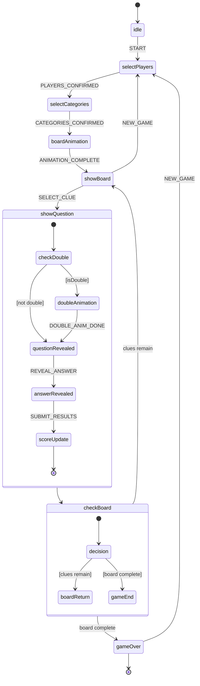

# Triviaton

A free, open-source trivia game inspired by **Jeopardy!** that you can play with friends, family, or coworkers right from your computer. No accounts, no sign-ups, no cost -- just pick your players, choose your categories, and start playing.

---

## What is this?

Triviaton turns any computer into a Jeopardy-style game show. One person acts as the **host** (using the Admin screen) while everyone else watches the **Game screen** -- ideally on a TV or projector. The host controls the flow: picking questions, revealing answers, and keeping score.

### Basic Rules (Jeopardy-style)

1. **The Board** -- 6 categories are displayed, each with 5 questions of increasing difficulty (and value).
2. **Picking a Question** -- The host selects a question from the board. The question is shown to all players.
3. **Answering** -- Players try to answer. The host decides who got it right or wrong.
4. **Scoring** -- Correct answers **add** the question's value to your score. Wrong answers **subtract** it.
5. **Daily Doubles** -- Two hidden questions on the board are worth **double** their value. Only one player answers a Daily Double.
6. **Game Over** -- Once all questions have been answered, the player with the highest score wins!

---

## How to Run It

### What you need first

You need **Node.js** installed on your computer. If you don't have it yet, follow the step for your operating system below.

#### Install Node.js

| System  | How to install |
|---------|---------------|
| **Mac** | Open **Terminal** (search for it in Spotlight) and paste: `brew install node` <br>If you don't have Homebrew, go to [https://nodejs.org](https://nodejs.org) and download the installer instead. |
| **Windows** | Go to [https://nodejs.org](https://nodejs.org), download the **LTS** version, and run the installer. Accept all defaults. |

To check if Node.js is already installed, open a terminal and type:

```bash
node -v
```

If you see a version number (like `v18.x.x` or higher), you're good to go.

---

### Step-by-step

**1. Download the project**

If you have Git installed:

```bash
git clone https://github.com/YOUR_USERNAME/triviaton.git
cd triviaton
```

Or simply download the ZIP from GitHub and extract it.

**2. Install dependencies**

Open a terminal inside the project folder and run:

```bash
npm install
```

> **Mac**: Open **Terminal**, type `cd ` (with a space), drag the project folder into the Terminal window, and press Enter. Then run the command above.
>
> **Windows**: Open the project folder in File Explorer, click the address bar, type `cmd`, and press Enter. Then run the command above.

**3. Start the game**

```bash
npm run dev
```

You'll see a message saying the server is running at `http://localhost:3000`.

**4. Open two browser windows**

| Window | URL | Purpose |
|--------|-----|---------|
| **Admin / Host** | [http://localhost:3000/admin](http://localhost:3000/admin) | The host controls the game from here |
| **Game Display** | [http://localhost:3000/game](http://localhost:3000/game) | Show this on a TV or projector for all players to see |

**5. Play!**

- On the **Admin** page: enter player names, pick 6 categories, and start the game.
- The **Game** screen will show the board, questions, and scores in real time.
- When all questions are done, the winner is revealed with a celebration animation.

---

## Adding Your Own Questions

Questions live as simple YAML files inside the `questions/` folder. Each file is one category. Here's an example:

```yaml
name: "Science"
types:
  - science
  - stem
questions:
  - question: "What planet is known as the Red Planet?"
    answer: "Mars"
    value: 200
  - question: "What is the chemical symbol for gold?"
    answer: "Au"
    value: 400
  - question: "What gas do plants absorb from the atmosphere?"
    answer: "Carbon dioxide"
    value: 600
  - question: "What is the hardest natural substance on Earth?"
    answer: "Diamond"
    value: 800
  - question: "What is the speed of light in km/s (approximately)?"
    answer: "300,000 km/s"
    value: 1000
```

Each category needs **at least 5 questions**. After adding a new file, restart the server (`Ctrl+C` then `npm run dev`).

---

## Tech Stack

| Technology | Role |
|------------|------|
| [**Next.js 15**](https://nextjs.org/) | React framework with App Router -- handles both the frontend UI and the backend API routes |
| [**React 18**](https://react.dev/) | Component-based UI rendering |
| [**XState v5**](https://xstate.js.org/) | Finite state machine that manages the entire game logic and transitions |
| [**@xstate/react**](https://xstate.js.org/docs/packages/xstate-react/) | React bindings for XState |
| [**Mantine v7**](https://mantine.dev/) | UI component library for buttons, overlays, loaders, and layout |
| [**Server-Sent Events (SSE)**](https://developer.mozilla.org/en-US/docs/Web/API/Server-sent_events) | Real-time one-way communication from the Admin to the Game display |
| [**TypeScript**](https://www.typescriptlang.org/) | Static typing for safer, self-documenting code |
| [**js-yaml**](https://github.com/nodeca/js-yaml) | Parses YAML question files at runtime |
| [**PostCSS**](https://postcss.org/) | CSS processing (with Mantine preset) |

---

## Game State Machine

The entire game flow is driven by an **XState finite state machine**. Below is a visual representation of every state and transition:



---

## Project Structure

```
triviaton/
├── questions/              # YAML question files (one per category)
├── public/sounds/          # Optional MP3 sound effects
├── src/
│   ├── app/
│   │   ├── admin/          # Admin / host control page
│   │   ├── game/           # Game display page (for players)
│   │   └── api/game/       # API routes (questions, state sync, SSE stream)
│   ├── components/
│   │   ├── admin/          # Admin UI components
│   │   └── game/           # Game display components
│   ├── lib/                # Utilities (question loader, game store)
│   ├── machines/           # XState state machine definition
│   └── types/              # TypeScript type definitions
├── package.json
├── tsconfig.json
├── next.config.ts
└── postcss.config.mjs
```

---

## Notes

- The game runs **locally** -- no internet connection needed once dependencies are installed.
- The **Admin page must stay open** during the game (it drives the state machine).
- Game state is held in memory; restarting the server resets everything.
- Sound effects are optional -- drop MP3 files into `public/sounds/` if you want them.

---

## License

MIT -- free for everyone, forever.
